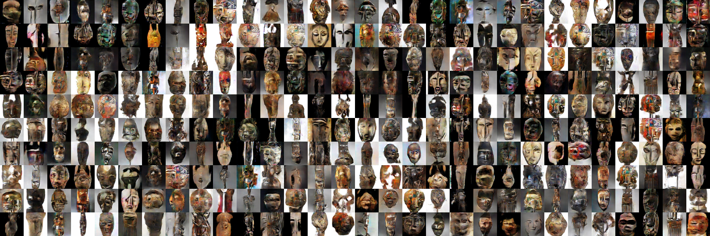

## Train a GAN using TPUs and Tensorflow on Google Cloud

> Screenshot below shows 64px images generated using the code provided.



This repo contains code to train an unconditional DCGAN ([Radford et al 2017](http://www.arxiv.org/pdf/1511.06434.pdf)) using TPUs on Google Cloud. It is based on the [DCGAN TPU example](https://github.com/tensorflow/tpu/tree/master/models/experimental/dcgan) by the Google Tensorflow team with the following modifications  

- Support for `64*64` and `128*128` generation: Provide two model architectures (mainly additional layers) that support generating higher resolution images (64, 128).
- Images to TFRecords: A [script](utils/convert_to_tfrecords.py) is available to convert images in a folder to TFRecords required to train the DCGAN.
- Trained models: Trained [models](models) for generating masks are available in the models folder and a [script](generate_from_model.py) for generating images is included.

## Convert Images

The `convert_to_tfrecords` script accepts arguments for data directory (`data_dir`) and output file (`output_file`). Data directory is expected to have folders which contain images directly.

```shell
python convert_to_tfrecords --data_dir=images/cifar --output_file=images/cifar/train.tfrecords --image_size=128
```

Expected
```
images
├── cifar
    ├── train
        └── train_image1.jpg
        └── train_image2.jpg
    └── test
        └── test_image1.jpg
        └── test_image2.jpg
```

## Training

- Please follow the official tensorflow tutorial on [setting up a TPU instance](https://cloud.google.com/tpu/docs/quickstart). Also see tutorial on running sample [MNIST model](https://cloud.google.com/tpu/docs/tutorials/mnist) on TPUs. 
- Clone this repo
```shell
git clone https://github.com/victordibia/tpuDCGAN
```
- Start Training
```shell
export GCS_BUCKET_NAME=  <Your GCS Bucket>
python dcgan_main.py --tpu=$TPU_NAME --train_data_file=gs://$GCS_BUCKET_NAME/data/masks/train_masks.tfrecords   --dataset=dcgan64 --train_steps=10000 --train_steps_per_eval=500 --model_dir=gs://$GCS_BUCKET_NAME/dcgan/masks/model --test_data_file=gs://$GCS_BUCKET_NAME/data/rand/test.tfrecords

```

## Trained Models

Interested in generating masks? This repo contains two trained [models](models) (64px and 128px). You can use the generate script to generate images using any of the models.

```
python generate_from_model.py --model_dir=models/masks/128/model.ckpt-15000 --image_size=128 --output_dir=models/masks/128
```